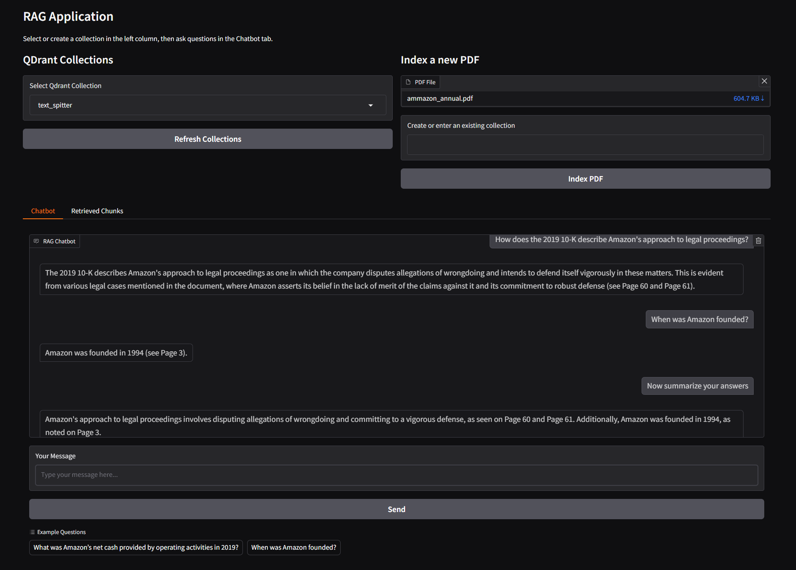

# RAG Chatbot for Amazon 10-K Financial Analysis

## Table of Contents
- [Overview](#overview)
- [Features](#features)
- [Installation](#installation)
- [Usage](#usage)
- [Enjoy the Chatbot!](#enjoy-the-chatbot)


## Overview
This project implements a **Retrieval-Augmented Generation (RAG)** chatbot designed to answer questions about **Amazon 10-K** reports and related financial documents. It uses:
- **QDrant** as the vector database for document indexing, retrieval and semantic search.
- **LangChain-Community** for chunk splitting, embedding, and chat model integration.
- **OpenAI embeddings and chat model** for answer generation.
- **Gradio** for a user-friendly UI, enabling document upload and question-answering sessions.
- **RAGAS** (Retrieval-Augmented Generation Assessment Score) for evaluating the chatbot’s performance ().

Through a Docker-based setup, the app hosts a **Gradio** UI that allows you to upload PDF files, index them into Qdrant, and then chat with an LLM that references the newly added documents.

## Features
1. **Document Ingestion**: Upload PDFs files, which are then split and embedded via `OpenAIEmbeddings`.

2. **Vector Store with QDrant**: Indexed documents are stored in QDrant collections, enabling fast semantic search.

3. **Gradio UI**: A user-friendly chat interface for:
   - Selecting or creating Qdrant collections.
   - Asking questions with real-time references to the source text.
   - Displays retrieved chunks so users can verify the source of each answer.

4. **RAGAS Evaluation**: An optional script (`ragas_eval.py`) measures the chatbot’s performance using metrics like: answer relevance, correctness, factual correctness, faithfulness, and context recall.

5. **Docker & Docker Compose**  
   - Spin up the entire system (QDrant + app) via Docker for consistent environment setups.

6. **RAGAS** (Retrieval-Augmented Generation Assessment Score) provides a suite of metrics to evaluate the chatbot’s performance.
   - For details on the RAGAS evaluation methodology and results, see the README in src.

7. **Sentence-Window Retrieval**:  
   - **What It Does**: Splits documents into overlapping windows based on sentences rather than arbitrary chunks.  
   - **Benefits**: This method preserves the natural flow and context of the text, ensuring that nuanced details across sentence boundaries are maintained. This results in more semantically relevant retrievals, especially for complex financial documents where context spans multiple sentences.

8. **Auto-merging Retrieval**:  
   - **What It Does**: Automatically combines adjacent or related retrieved text chunks into a single, coherent passage.  
   - **Benefits**: By merging fragmented pieces of context, the system delivers clearer and more unified information to the language model, reducing the risk of disjointed responses and improving overall answer clarity.

9. **Chat Memory Features**:  
   - **What It Does**: Maintains conversation history across multiple interactions within a session.  
   - **Benefits**: This feature allows the chatbot to reference previous messages, ensuring that follow-up questions are answered with an awareness of the ongoing dialogue. The result is a more coherent, contextually aware conversation that can handle multi-turn queries seamlessly.

10. Pytest Unit Tests:  
    - Ensures that the core functionalities of the chatbot, including document indexing, retrieval, and answer generation, are working as expected.


## Installation

1. Clone your fork locally:
   ```bash
   git clone https://github.com/rostyslavshovak/RAG-Retrieval-Augmented-Generation.git
   cd <RAG-Retrieval-Augmented-Generation>
    ```

2. **Install Dependencies** (if running locally without Docker):
   ```bash
   pip install --no-cache-dir -r requirements.txt
    ```

3. Create a `.env` file in the root directory:
   ```bash
   touch .env
    ```

   Add the following environment variables as described in `example.env`.

   ```ini
   OPENAI_API_KEY=sk-xxxxxx
   RAGAS_APP_TOKEN=apt.xxxxxx
   
   MODEL_NAME=gpt-3.5-turbo
   TEMPERATURE=0.7
   MAX_TOKENS=500
   EMBEDDING_MODEL=text-embedding-ada-002
   #EMBEDDING_MODEL=sentence-transformers/all-MiniLM-L6-v2
   
   HOST=localhost
   PORT=6333
   ```

## Usage

1. Launch the Chatbot locally (non-Docker):

    ```bash
    python -m src.gradio_ui
     ```
   
   - Access the UI by visiting [http://localhost:7860/](http://localhost:7860/) in your browser.

2. Or run via Docker:

   **Note**: Make sure Docker and Docker Compose are installed, and Docker is running before proceeding.

  - Run:
    ```bash
    docker-compose up --build
    ```
  
   This will launch Qdrant on port 6333 and the Gradio app on port 7860 (or the mapped port you set in docker-compose.yml).
   Access the UI by visiting [http://localhost:7860/](http://localhost:7860/) in your browser.

3. Indexing and Chat
   - Index a Document: Within the Gradio app, click “Index a new PDF”, upload a file, and specify a new or existing Qdrant collection name.
   - Ask Questions: Switch to the “Chatbot” tab, select a collection you just created, and type queries. The relevant chunks will appear in the “Retrieved Chunks” tab.


## Enjoy the Chatbot!


