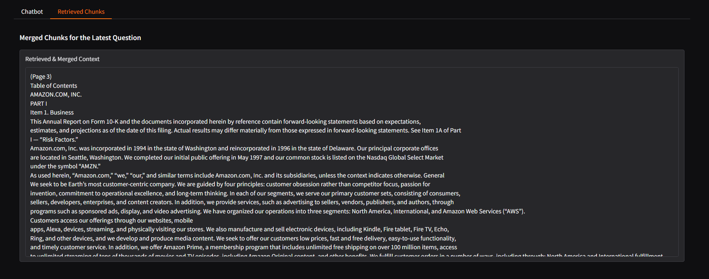

# RAG Chatbot for Amazon 10-K Financial Analysis

## Table of Contents
- [Overview](#overview)
- [Features](#features)
- [Installation](#installation)
- [Usage](#usage)
- [Enjoy the Chatbot!](#enjoy-the-chatbot)

---

## What is RAG?

**Retrieval-Augmented Generation (RAG)** is an approach that combines information retrieval with the generative capabilities of Large Language Models. It works in three simple steps:

1. **Retrieve**: Extract documents from a knowledge base.
2. **Augment**: Add relevant context to the user prompt.
3. **Generate**: Generate an answer using the language model.

This method is particularly effective for domain-specific queries, ensuring responses are grounded in up-to-date and relevant information.

---

## Overview

This project implements a **Retrieval-Augmented Generation (RAG)** chatbot designed to answer questions about **Amazon 10-K** reports and related financial documents. It utilizes:

- **QDrant**: Serves as the vector database for document indexing, retrieval and semantic search.
- **LangChain-Community**: Handles chunk splitting, embedding, and chat model integration.
- **OpenAI Embeddings and Chat model**: Powers answer generation.
- **Gradio**: User-friendly UI for document upload and question-answering sessions.
- **RAGAS (Retrieval-Augmented Generation Assessment Score)**: Evaluates the chatbot’s performance using various metrics.

The application is containerized using Docker, offering a consistent environment setup. With Gradio as the front-end, users can upload PDFs, index them into QDrant, and interact with an LLM that references the newly added documents.

---

## Features

1. **Document Ingestion**
   - Upload PDF files which are then split and embedded using `OpenAIEmbeddings`.

2. **Vector Store with QDrant**:
   - Indexed documents are stored in QDrant collections, enabling fast semantic search.
  
3. **Gradio UI**
   - User-friendly chat interface that allows you to:
     - Select or create QDrant collections.
     - Ask questions with real-time references to the source text.
     - View retrieved text chunks, ensuring transparency on the source of each answer.
    
4. **RAGAS Evaluation**
   - For details on the RAGAS evaluation methodology and results, see the [README](src/README.md).
   - An optional script ([`ragas_eval.py`](src/ragas_eval.py)) measures performance using metrics like:
     - Answer relevance
     - Correctness
     - Factual accuracy
     - Faithfulness
     - Context recall
   
5. **Docker & Docker Compose** 
   - Dockerize the entire system (QDrant + App) for consistent environment setup.
  
6. **Sentence-Window Retrieval**
   - **Functionality**: Splits documents into overlapping windows based on sentences rather than arbitrary chunks.  
   - **Benefits**: Preserves the natural flow and context of the text, ensuring that nuanced details are maintained. This results in more semantically relevant retrievals, especially for complex financial documents where context spans multiple sentences.

7. **Auto-merging Retrieval**:  
   - **Functionality**: Automatically combines adjacent or related retrieved text chunks into a single, coherent passage.  
   - **Benefits**: Reduces disjointed responses by providing unified context to the language model, thereby improving answer clarity.

8. **Chat Memory Features**:  
   - **Functionality**: Maintains conversation history across multiple interactions.  
   - **Benefits**: Enables the chatbot to reference previous messages, ensuring contextually aware responses in multi-turn dialogues.

9. **Unit Tests**:  
   - Ensures core functionalities (document indexing, retrieval, and answer generation) work as expected.

---

## Installation

1. Clone your fork locally:
   ```bash
   git clone https://github.com/rostyslavshovak/RAG-Retrieval-Augmented-Generation.git
   cd RAG-Retrieval-Augmented-Generation
    ```

2. **Install Dependencies** (if running locally without Docker):
   ```bash
   pip install --no-cache-dir -r requirements.txt
    ```

3. Create a `.env` file in the root directory:
   ```bash
   touch .env
    ```

   Then add the following environment variables (refer to `example.env` for guidance).

   ```ini
   OPENAI_API_KEY=sk-xxxxxx
   RAGAS_APP_TOKEN=apt.xxxxxx
   
   MODEL_NAME=gpt-3.5-turbo
   TEMPERATURE=0.7
   MAX_TOKENS=500
   EMBEDDING_MODEL=text-embedding-ada-002
   #EMBEDDING_MODEL=sentence-transformers/all-MiniLM-L6-v2
   
   HOST=localhost
   PORT=6333
   ```
---

## Usage

1. Launch the Chatbot locally (non-Docker):

    ```bash
    python -m src.gradio_ui
     ```
   
   - Access the UI at [http://localhost:7860/](http://localhost:7860/) in your browser.

2. Alternatively run with Docker:
   **Note**: Ensure Docker and Docker Compose are installed and running before proceeding.
   
  - Run the following command to launch both QDrant (on port 6333) and the Gradio app (on port 7860):
    ```bash
    docker-compose up --build
    ```
  
   Access the UI at [http://localhost:7860/](http://localhost:7860/) in your browser.

3. Indexing and Chat
   - Index a Document: In the Gradio Web, click “Index a new PDF”, upload a file, and specify a new or existing QDrant collection name.
   - Ask Questions: Switch to the “Chatbot” tab, select the desired collection, and enter your queries. Retrieved chunks will appear in the "Retrieved Chunks" tab.

---

## Enjoy the Chatbot!


